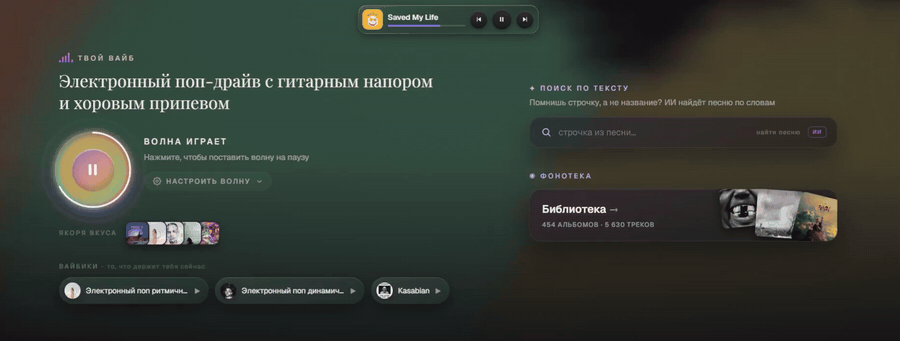
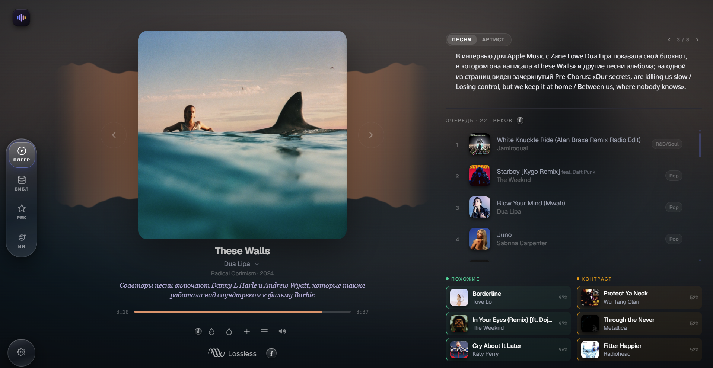
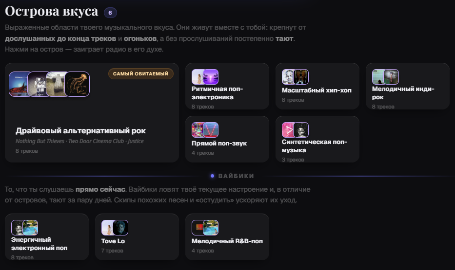
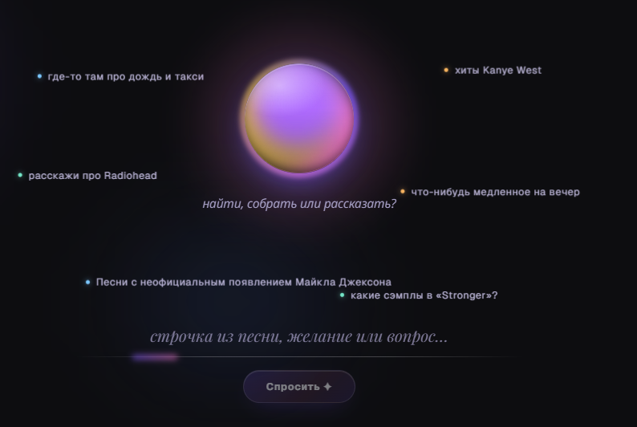
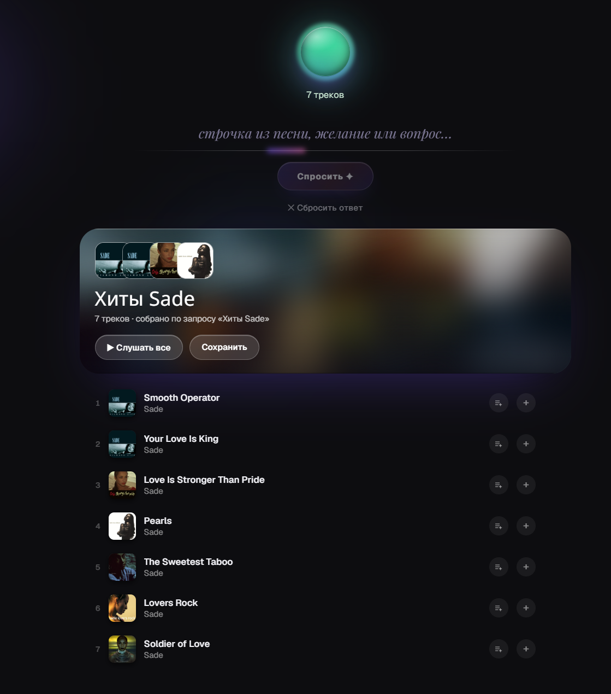
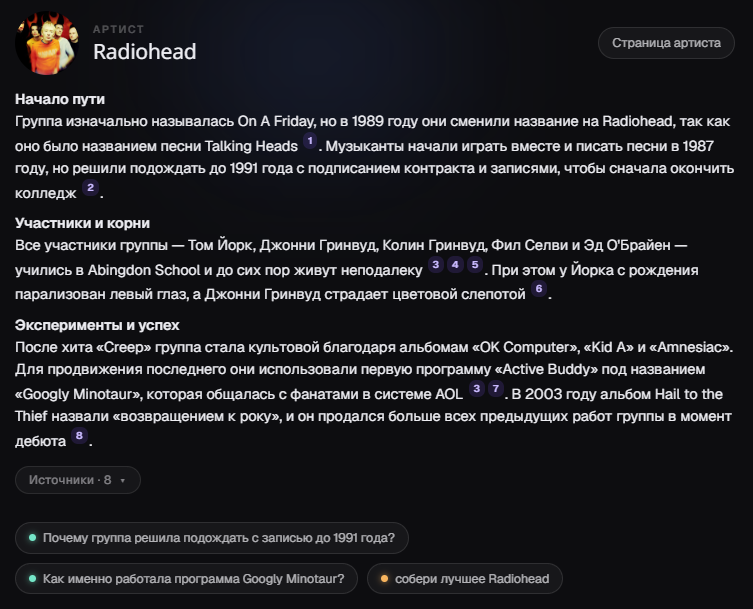
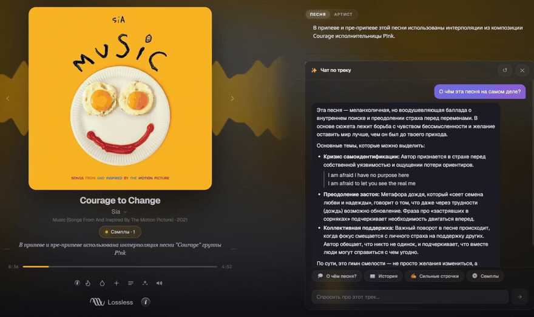
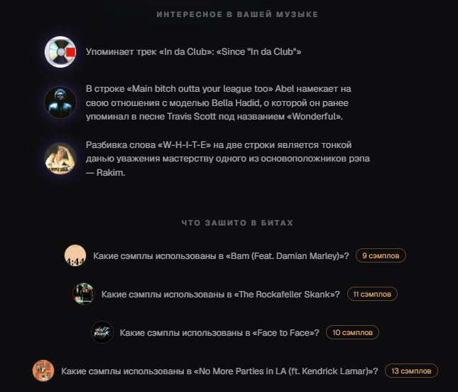
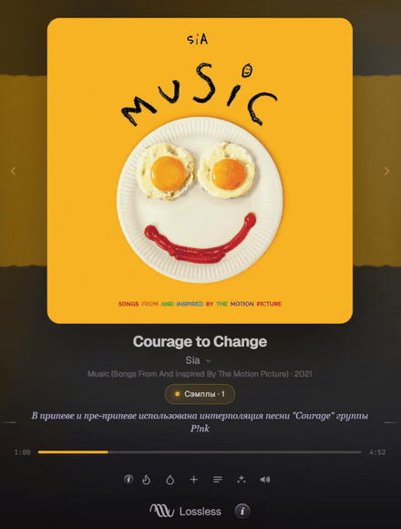
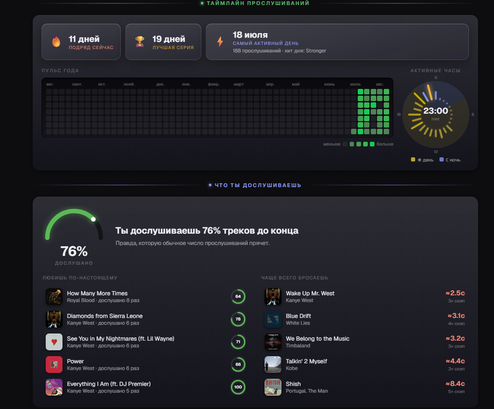

# 🎵 MusiX — плеер нового поколения

> **Подними свой Spotify или Яндекс Музыку у себя дома.** Бесплатно, без риска
> потерять любимые треки и без буллшита в рекомендациях — зато с настоящим
> погружением в биографии и факты исполнителей.
> **Не только слушай музыку — узнавай её.**



MusiX — это музыкальный плеер для **твоей собственной библиотеки**. Всё работает
на твоей машине: плеер, рекомендации, база и (по желанию) ИИ. Никакого облака,
никакой подписки, никаких чужих «вам может понравиться».

---

## ✨ Что умеет

### 🖥️ Современный дизайн — на компьютере и в телефоне

Живой амбиент главного экрана подстраивается под обложку играющего трека (гифка
выше). Интерфейс полностью адаптирован под мобильные устройства, а благодаря
**PWA** MusiX ставится на телефон как обычное приложение — с иконкой на рабочем
столе и управлением с экрана блокировки.

Сам плеер сделан легко: меняй очередь проигрывания на лету, читай факты про
песню и исполнителя прямо во время прослушивания — а если что-то стало
интересно, вызывай ИИ-ассистента, не выходя из плеера.

<p align="center"></p>

### 🌊 Рекомендации, которые привыкают именно к тебе

Собственноручно разработанный движок рекомендаций **привыкает к повадкам каждого
пользователя**: не скачет с жанра на жанр, музыка плавно перетекает вслед за твоим
настроением. Волну можно настроить под себя — больше редких находок или больше
любимого.

<p align="center"></p>

MusiX автоматически разбивает твой вкус на несколько направлений — **острова
вкуса**. Они живут вместе с тобой: крепнут от дослушанных треков и постепенно
тают без внимания. Любой остров запускается как автособранный плейлист прямо с
главной страницы.

Зашёл трек — **добавь огонька** 🔥. Хочется чего-то другого — плесни **воды** 💧.
Быстрая смена вайба одним касанием, и волна тут же подстраивается.

### 🧙 ИИ-гуру меломан

Просто скажи ассистенту, что хочешь — он сам всё сделает:

> «спокойные песни под поездку домой летним вечером»
> «хиты Канье Уэста, где он читает рэп, а не поёт»

<p align="center"></p>
<p align="center"></p>

Но плейлисты — только начало. Спрашивай его про историю любимых исполнителей,
интересные факты и особенности создания конкретных песен:

<p align="center"></p>

Он же объяснит **любую строчку песни** — просто ткни в неё прямо в тексте, и
получишь разбор смысла, отсылок и игры слов:

<p align="center"></p>

А ещё ищи песни **по строчке из текста** («где-то там про дождь и такси») или
**по звучанию** — такого больше нет нигде.

### 🔗 Взаимосвязи твоей музыки

Узнавай, как твоя коллекция связана изнутри: кто кого семплировал, у каких
треков общий продюсер, и на каком лейбле встретились два совершенно разных
артиста. Сэмплы и продюсеры видны прямо в плеере — бейджи под обложкой
раскрываются в карточки с деталями.

<p align="center"></p>

<p align="center"></p>

### 📊 Статистика, которую больше никто не покажет

Самый активный час и дни прослушивания, серии дней подряд, и главное — **сколько
песен ты дослушиваешь до конца**. Правда, которую обычное число прослушиваний
прячет.

<p align="center"></p>

---

## 🎧 Твоя музыка — твои файлы

MusiX — именно **плеер**: в него загружаются твои музыкальные файлы, и они
навсегда остаются твоими.

- **Lossless для аудиофилов** — FLAC/ALAC проигрываются без сжатия, как записано.
- **Импорт из Яндекс Музыки** — с подпиской Яндекс Плюс можно перенести свои
  плейлисты в MusiX в пару кликов.

---

## 🚀 Установка (Docker — самый простой путь)

Всё — приложение, база поиска (Qdrant) и помощник веб-поиска (SearXNG) —
работает в **Docker**-контейнерах. Не нужно ставить Python или ИИ-модели
вручную: **одна команда** скачает и запустит всё сама.

### Шаг 0 — установи Docker Desktop (один раз)

Скачай **Docker Desktop** с
<https://www.docker.com/products/docker-desktop/> и установи с настройками по
умолчанию. Запусти его и дождись, пока иконка кита скажет, что всё работает.

> 💡 На Windows Docker Desktop предложит включить **WSL2** — соглашайся.

### Шаг 1 — скачай проект

Скачай этот репозиторий как ZIP с GitHub и распакуй (или `git clone`, если
знаком с Git). Запомни, куда положил папку.

### Шаг 2 — открой терминал **внутри** папки проекта

- **Windows:** открой распакованную папку в Проводнике, кликни в адресную
  строку сверху, набери `cmd` и нажми **Enter**. Откроется чёрное окно, уже
  находящееся в нужной папке.
- **macOS/Linux:** открой Терминал и перейди в папку через `cd`.

### Шаг 3 — (по желанию) добавь свои настройки

MusiX работает из коробки, но можно подключить ИИ и задать секрет
безопасности. Создай свой файл настроек:

```bash
copy .env.example .env       # Windows
# cp .env.example .env       # macOS/Linux
```

Открой `.env` в любом текстовом редакторе и заполни, что нужно (все поля
подписаны). Этот шаг можно пропустить и вернуться к нему позже.

### Шаг 4 — запусти всё

```bash
docker compose up -d --build
```

Первый запуск скачивает несколько гигабайт (образ приложения + ИИ-модели),
так что займёт время. Когда закончится — MusiX тихо работает в фоне.

### Шаг 5 — открой в браузере

Заходи на **<http://localhost:8000>**. Мастер первого запуска создаст аккаунт
владельца → укажи MusiX свою музыку → слушай. 🎉

### Повседневные команды

```bash
docker compose ps        # что запущено
docker compose logs -f   # смотреть вывод приложения (Ctrl+C — перестать смотреть)
docker compose down      # остановить всё
docker compose up -d     # запустить снова (--build больше не нужен)
```

> **Папка с музыкой:** чтобы индексировать музыку прямо с диска (без
> копирования на сервер), поправь в `docker-compose.yml` строку
> `"/mnt/music:/music"` на свою папку — например `"D:/Music:/music:ro"` на
> Windows. Внутри приложения эта папка будет видна как `/music`.

> **Нет NVIDIA-видеокарты?** Открой `docker-compose.yml` и удали блок
> `deploy.resources` у сервиса `musix` — приложение само переключится на CPU
> (можно закрепить это явно через `FORCE_CPU=1` в `.env`). Всё будет работать,
> просто индексация пройдёт медленнее.

### Два режима работы

При первом запуске MusiX спросит, где живёт твоя музыка:

- **📁 Локальный режим** — музыка уже на этом компьютере: она индексируется на
  месте и проигрывается прямо с устройства. Один пользователь, ноль лишних
  движений.
- **🌐 Режим сервера** — MusiX становится домашним музыкальным сервером: ты и
  твои близкие **загружаете музыку с других устройств прямо на него** и
  слушаете каждый под своим аккаунтом, со своей библиотекой и своими
  рекомендациями.

### Что работает без ИИ

Рекомендации, прослушивание, биографии и изображения артистов доступны **в
любом случае** — без всякой настройки. А вот ИИ-ассистент, переведённые на твой
язык факты и поиск песен по тексту/звучанию включаются при подключении LLM:
укажи в `.env` (или в настройках админа) любой OpenAI-совместимый эндпоинт —
локальный **LM Studio**/**Ollama** на своей видеокарте или облачный API.

<details>
<summary>Запуск без Docker (для разработки)</summary>

```bash
# 1. Поднять Qdrant + SearXNG
docker compose up -d qdrant searxng

# 2. Установить зависимости (Python 3.11+, CUDA-сборки torch — см. requirements.txt)
pip install -r requirements.txt

# 3. Собрать фронтенд (Vite): FastAPI раздаёт frontend/dist/
cd frontend && npm ci && npm run build && cd ..

# 4. Запустить сервер (QDRANT_URL по умолчанию http://localhost:6333)
uvicorn app.api.main:app --reload --host 0.0.0.0 --port 8000 --log-config logging.conf
```

Для живой разработки фронтенда: `cd frontend && npm run dev` (HMR-прокси на
бэкенд).
</details>

<details>
<summary>Проверка живого стека (реальный Qdrant + реальные модели)</summary>

Большинство тестов мокают Qdrant и ML-библиотеки, поэтому `pytest` работает
где угодно. Небольшой набор в `tests/docker/` гоняет настоящий стек — реальные
эмбеддинги, реальный Qdrant, реально загружающийся CLAP. Запускается внутри
работающего контейнера:

```bash
docker compose up -d
scripts/run_docker_tests.sh
```

Первый запуск скачает модель эмбеддингов (~1 ГБ) и чекпоинт CLAP (~2.3 ГБ) в
примонтированные тома; дальше они переиспользуются.
</details>

---

## 🧠 Под капотом

- **Агентная система** поверх любого OpenAI-совместимого LLM: планировщик
  разбирает запрос, сам выбирает инструменты (поиск по библиотеке, веб-поиск,
  факты) и собирает ответ. Веб-поиск работает через **RAG с context-aware
  chunking**: страницы режутся по смыслу, и в модель попадают только
  релевантные куски — поэтому даже небольшие локальные модели отвечают
  предметно.
- **Рекомендации и поиск по звучанию — на CLAP**: каждый трек получает
  аудио-эмбеддинг (как он *звучит*), текстовый dense-вектор по лирике и
  sparse BM25. Текстовый поиск — RRF-фьюжн dense+BM25, поиск по звучанию —
  CLAP text→audio, волна рекомендаций — движение по этому векторному
  пространству с учётом огоньков, воды и дослушиваний.
- **Факты о песнях** берутся со Songfacts и обогащаются LLM-конвейером
  (сэмплы, отсылки, взаимосвязи артистов).
- Стек: **FastAPI** + **Qdrant** (векторная база) + **SearXNG** (метапоиск) +
  **React/Vite** SPA; всё упаковано в Docker Compose.

---

## 📜 Лицензия

**Apache License 2.0** — используй, изменяй и распространяй MusiX, в том числе
коммерчески, сохраняя атрибуцию и `NOTICE`. Полный текст — в файле
[LICENSE](LICENSE).
